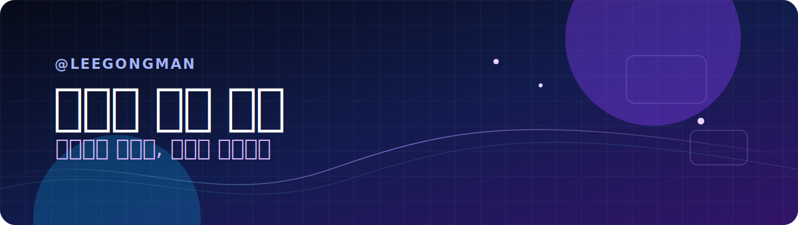

<p align="center">
  
</p>

<p align="center">
  <strong>컴퓨터공학 · 언어 모델 · 생성형 인공지능</strong>
</p>

---

## 안녕하세요, 공만입니다 👋

컴퓨터공학을 공부하며, 머릿속의 질문을 코드와 실험으로 꺼내 보는 일을 좋아합니다.  
새로운 주제를 만나면 먼저 왜 그런지 파고들고, 작게라도 직접 구현해 본 뒤, 결과가 말해 주는 다음 질문을 따라갑니다.

LLM과 생성형 인공지능을 공부하고 있으며, 여러 대회에 참여하며 제한된 시간 안에 가설을 세우고 검증하는 경험을 쌓아왔습니다. 지금은 생성 모델을 더 깊이 이해하기 위해 **LS-GAN 연구**를 이어가고 있습니다.

## 지금의 관심사

### 01. 언어 모델

문장을 그럴듯하게 만드는 것을 넘어, 언어 모델이 실제 문제를 어떻게 더 잘 이해하고 도울 수 있는지에 관심이 있습니다. 모델의 답을 그대로 받아들이기보다, 왜 그런 답이 나왔는지 끝까지 살펴보려 합니다.

### 02. 생성형 인공지능

좋은 결과 한 장보다 더 궁금한 것은 그 결과에 도달하는 과정입니다. 데이터와 모델, 학습 방식의 작은 차이가 생성 결과를 어떻게 바꾸는지 실험하며 배우고 있습니다.

### 03. LS-GAN 연구

**Least Squares GAN(LS-GAN)**은 생성 모델 학습에서 안정적인 신호를 주기 위해 제안된 접근입니다. 이 주제를 따라가며 생성 모델의 구조와 학습 과정을 제 방식으로 이해하고 기록하고 있습니다.

## 배우고 만드는 루프

```text
질문을 발견한다  →  직접 구현한다  →  결과를 기록한다  →  다음 실험을 설계한다
```

대회는 이 루프를 가장 빠르게 반복하게 해 준 공간이었습니다. 한정된 시간과 데이터 안에서 무엇을 먼저 확인할지 정하고, 실패한 실험에서도 다음 선택의 근거를 찾는 과정을 중요하게 생각합니다.

## 이곳에 남길 것

프로젝트를 만들며 마주친 고민, 연구 과정에서 얻은 관찰, 그리고 문제를 풀며 배운 것들을 남깁니다. 결과만 보이기보다, 그 결과에 닿기까지 어떤 질문을 했는지 함께 기록하고 싶습니다.

<p align="center">
  <sub>호기심을 코드로, 질문을 실험으로.</sub>
</p>
